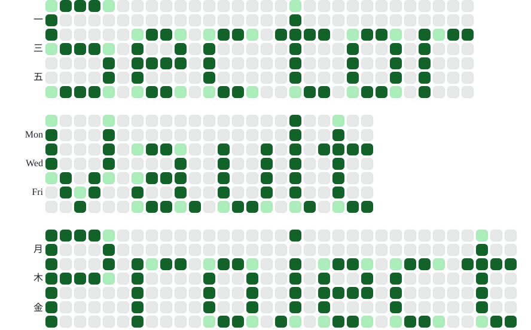

#  Sector Vault Project

一个基于Git的去中心化储存的调音工程分享网站。

对标bowroll.net和vsqx.top，期望提供更好更稳定的用户体验。

挂靠Git平台部署，拥有企业级可靠性，能够多平台部署多线路接入，理论上平台不倒本站不宕机。

零后端设计，没有基础设施开销，实际消耗平台给所有用户的免费配额。

本站不拥有用户数据，用户生产数据归自己所有（实际视git托管平台用户协议可能不同）。

主站点作为“去中心”的一个节点，提供浏览和管理各平台git仓库的程序，只保留索引数据，类似p2p的tracker角色。

用户也可以执行部署静态页面，不向主站提交索引，当作自己的博客管理。

使用Git作为内容数据托管，天然支持版本管理，数据也能平滑迁移到任意git托管平台。

详细设计参考[设计文档](./DESIGN.md)